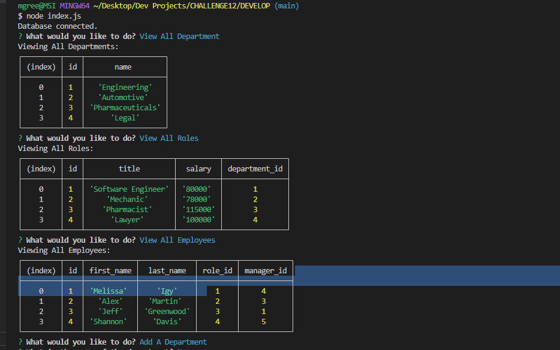

# Employee Tracker with MySQL

   
  ## Table-of-Contents
  * [Description](#description)
  * [Installation](#installation)
  * [Usage](#usage)
  * [Contributing](#contributing)
  * [Tests](#tests)
  * [Questions](#questions)
  
  ## [Description](#table-of-contents)
  This app creates a database of employees, their respective department, role, and salary. Using node, the user can easily add new departments and roles, along with new employees and their require information. 

  ## [Installation](#table-of-contents)
  The user will use the command "node index.js" to start the application.
  ## [Usage](#table-of-contents)
    
     Link to video of the usage.
   View walkthrough video here - [Screencastify](https://drive.google.com/file/d/1CPRhaAcjL9FzpL7vfg2qtuIjHRYB0dw4/view)
  ## [Contributing](#table-of-contents)
  I am not accepting contributions at this time.
  ## [Tests](#table-of-contents)
  
  ## [Questions](#table-of-contents)
  Please contact me using the following links:  
  [GitHub](https://github.com/melissaigy)  
  [Email: melissaigyarto@gmail.com](mailto:melissaigyarto@gmail.com)